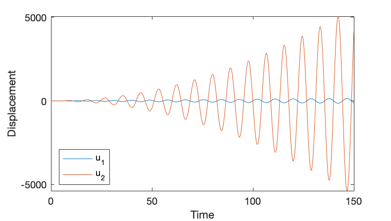

# One Dimensional Mass Spring System

Apply asymptotic expansion, we can solve spring mass damper system, which is a second order ODE. 

## Regular Perturbation 

Spring mass damper with small damping. 

> In contrast to singular perturbation problems, which spring mass damper with small mass/inertia, this will be a highly damped system which will oscillate when the mass is not equal to zero. 

Let's cast the problem in terms of the mathematical model with initial condition:
$$\begin{array}{c}
m \frac{d^{2}u}{dt^{2}} + c\frac{du}{dt} + ku = 0, \quad u(0) = u_{0} \quad and \quad \frac{du(0)}{dt} = 0
\end{array}$$
Where $m$ is mass, $c$ is damping coefficient, and $k$ is the stiffness of the spring. 
First, we need to nondimensionalize this problem which removes all units from this equation involving physical quantities:
$$\begin{array}{c}
v = \frac{u}{u_{0}}  \\ \tau = \frac{t}{T}
\end{array}$$
By introducing dimensionless variables, the differential operators becomes:
$$\begin{array}{c}
\frac{d}{dt} = \frac{d\tau}{dt}\frac{d}{d\tau} = \frac{1}{T}\frac{d}{d\tau}
\end{array}$$
> Multiple physical time scales: 
> Oscillation time scale $T_{o} = \sqrt{\frac{m}{k}}$
> Decay time scale $T_{d} = \frac{c}{k}$

After non-dimensionalizing, equation becomes:
$$\begin{array}{c}
m\frac{1}{T^{2}}u_{0}\frac{d^{2}v}{d\tau^{2}} + c\frac{1}{T}u_{0}\frac{dv}{d\tau} + ku_{0}v = 0
\end{array}$$
Since we are dealing with small damping, which means the inertia term and spring force almost in balance, and in perturbation theory, we first set the small perturbe term to be zero. If the magnitude of these two terms coefficients are equal, we can have $\frac{m}{T^{2}} = k$ and $T = \sqrt{\frac{m}{k}}$. 
Furthermore, by dividing this equation with coefficient of mass, coefficient of damping term will be: $\frac{c}{\sqrt{mk}} = \gamma$, cleaning up: 
$$\begin{array}{c}
\frac{d^{2}v}{d\tau^{2}} + \gamma\frac{dv}{d\tau} + v = 0
\end{array}$$
For future computational convenience, let $\gamma = 2\epsilon$, $\epsilon = \frac{c}{2\sqrt{mk}} \ll 1$. 
The leading term of perturbation series has zero damping, and the initial condition is $v(0) = 1$, $\frac{dv(0)}{d\tau} = 0$, then perturb the system by allowing $\epsilon$ to be nonzero. Formulate the solution to the new, perturbed system as a series:  
$$\begin{array}{c} v(\tau) = v_{0}(\tau)+ \epsilon v_{1}(\tau) + \epsilon^{2}v_{2}(\tau) + O(\epsilon^{3})
\end{array}$$
where we successively correct the things that we have removed from the problem. Also:
$$\begin{array}{c}\frac{dv(\tau)}{d\tau} =\frac{dv_{0}(\tau)}{d\tau} + \epsilon \frac{dv_{1}(\tau)}{d\tau} + \epsilon^{2}\frac{dv_{2}(\tau)}{d\tau} \\
\frac{d^{2}v(\tau)}{d\tau^{2}} =\frac{d^{2}v_{0}(\tau)}{d\tau^{2}} + \epsilon \frac{d^{2}v_{1}(\tau)}{d\tau^{2}} + \epsilon^{2}\frac{d^{2}v_{2}(\tau)}{d\tau^{2}} \end{array}$$
Now substitute above equation to the equation $\frac{d^{2}v}{d\tau^{2}}+2\epsilon\frac{dv}{d\tau}+v=0$ we have:
$$\begin{array}{c}
(\frac{d^{2}v_{0}(\tau)}{d\tau^{2}} + \epsilon \frac{d^{2}v_{1}(\tau)}{d\tau^{2}} + \epsilon^{2}\frac{d^{2}v_{2}(\tau)}{d\tau^{2}}) + 2\epsilon(\frac{dv_{0}(\tau)}{d\tau} + \epsilon \frac{dv_{1}(\tau)}{d\tau} + \epsilon^{2}\frac{dv_{2}(\tau)}{d\tau} ) + (v_{0}(\tau)+ \epsilon v_{1}(\tau) + \epsilon^{2}v_{2}(\tau)) = 0 \end{array}$$
and we can collect powers of $\epsilon$:
$$\begin{array}{cccc}
\epsilon^{0} &:& \frac{d^{2}v_{0}(\tau)}{d\tau^{2}}+v_{0}(\tau)  &=& 0 \\
\epsilon^{1} &:& \frac{d^{2}v_{1}(\tau)}{d\tau^{2}}+v_{1}(\tau) &=& -2\frac{dv_{0}(\tau)}{d\tau} \\ 
\epsilon^{2} &:& \frac{d^{2}v_{2}(\tau)}{d\tau^{2}}+v_{2}(\tau) &=& -2\frac{dv_{1}(\tau)}{d\tau} 
\end{array}$$
The initial condition tells us $v_{0} = 1$, we can easily conclude that $v_{1} = v_{2} = 0$, as well as those differential terms. 

Order $\epsilon^{0}$ terms.
The initial condition $v_{0}(0) = 1$ and $\frac{dv_{0}(0)}{d\tau}=0$. Solving differential equation we have: 
$$\begin{array}{c}
v_{0}(\tau) = cos(\tau) \\
\frac{dv_{0}(\tau)}{d\tau} = -sin(\tau) 
\end{array}$$
Order $\epsilon^{1}$ terms.
The initial condition $v_{1}(0) = 0$ and $\frac{dv_{1}(0)}{d\tau}=0$. Solving differential equation we have: 
$$\begin{array}{c}
v_{1}(\tau) = sin(\tau)-\tau cos(\tau) \\
\frac{dv_{1}(\tau)}{d\tau} = \tau sin(\tau) 
\end{array}$$
Order $\epsilon^{2}$ terms.
The initial condition $v_{2}(0) = 0$ and $\frac{dv_{2}(0)}{d\tau}=0$. Solving differential equation we have: 
$$\begin{array}{c}
v_{2}(\tau) = \frac{\tau^{2}}{2}cos(\tau)- \frac{\tau}{2}sin(\tau)
\end{array}$$
Finally, solution of this system up to $O(\epsilon^{3})$:
$$\begin{array}{c}
v(\tau) = cos(\tau) + \epsilon(sin(\tau)-\tau cos(\tau)) +\epsilon^{2}(\frac{\tau^{2}}{2}cos(\tau)- \frac{\tau}{2}sin(\tau)) + O(\epsilon^{3})
\end{array}$$

Comparison between the regular perturbation expansion and the exact solution. The two curves are reasonably close at the beginning, but they differ significantly for larger values of t.

$u_{1}$ and $u_{2}$ are secular term, because they are not bounded, we can see that $u_{1}$ eventually becomes as large as the first term, and $u_{2}$ grows exponentially. 

> `OneD_SpringMass_RPS.m` implements the regular perturbation solution and compared with exact-analytical solution given a long time period. You will see that RPS fails when $\epsilon$ is large and on a large time scale. 

> Q: How to construct a solution valid for longer time scales?

## Method of Multiple scales

Remember that $\epsilon = \frac{c}{2\sqrt{mk}}$, $\tau = \frac{t}{\sqrt{\frac{m}{k}}}$, there are two physical time scales that we are interested, one is oscillation time scale, another one is decay time scale, corresponde to fast time scale and slow time scale, respectively. First let $\tau_{1} = \tau$, $\tau_{2} = \epsilon\tau$. 

The perturbation series becomes: 
$$\begin{array}{c}
v(\tau) = \bar{v}_{0}(\tau_{1}, \tau_{2})+ \epsilon \bar{v}_{1}(\tau_{1}, \tau_{2}) + \epsilon^{2}\bar{v}_{2}(\tau_{1}, \tau_{2}) + O(\epsilon^{3})
\end{array}$$

Putting it together, the approximate solution solved by multiple scales:
$$\begin{array}{c}
v(\tau) = e^{-\tau_{2}}cos(\tau_{1})(1-\epsilon^{2}(\tau_{2}+\frac{\tau_{2}^{2}}{4})) +\epsilon e^{-\tau_{2}}sin(\tau_{1})(1+\frac{\tau_{2}}{2})
\end{array}$$

> This markdown contains $\LaTeX$ math. To see evaluated LaTeX code, open `README.html` in browsers 

